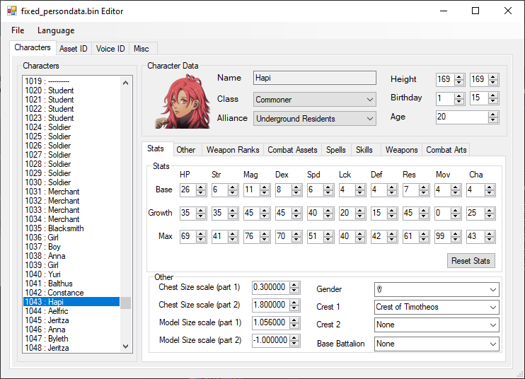

# Progenitor
Progenitor - All in one data editor for Fire Emblem: Three Houses  
 
Progenitor is built off the PersonData Editor built by DeathChaos25 and current supports everything included in that along with new features

Dependencies:
- .net Framework v4.7.2 https://dotnet.microsoft.com/download/dotnet-framework/net472

This program is still a very much WIP, some data may not be 100% accurate and there is probably bugs, make sure to backup your data files before editing.

## Data Editor

Includes an editor for Weapons, Magic, Turrets, Gambits, Monster AOE, Equipment, Items

## PersonData Editor

Includes Characters, Asset ID, Voice ID, Weapon Ranks, Spell list, Skill List, Combat Arts

### Credits
Makes use of (an earlier version of) [Amicitia.IO from TGEnigma](https://github.com/TGEnigma/Amicitia.IO). 

- Moonling, Progenitor Creator
- DeathChaos, PersonData Editor
- Raytwo, Dimy, and all the other members of the Research team
- [PKHeX](https://github.com/kwsch/PKHeX), Basic idea on a bit flag editor.